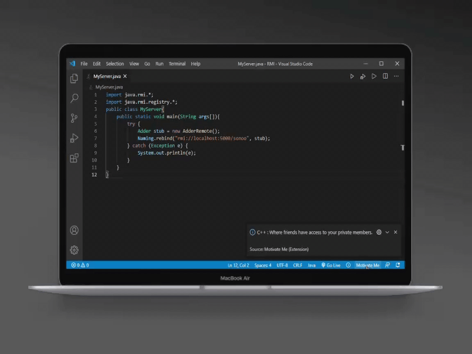

# MotivateMe

A VScode Extension to motivate you while you are coding and messedup with errors.

## Features

Tab on the Motivate Me Button in Status Bar.

For example:

## Requirements

Active Internet Connection.

## Release Notes

Users appreciate release notes as you update your extension.

### 1.0.0

Initial release of Motivate Me

-----------------------------------------------------------------------------------------------------------

